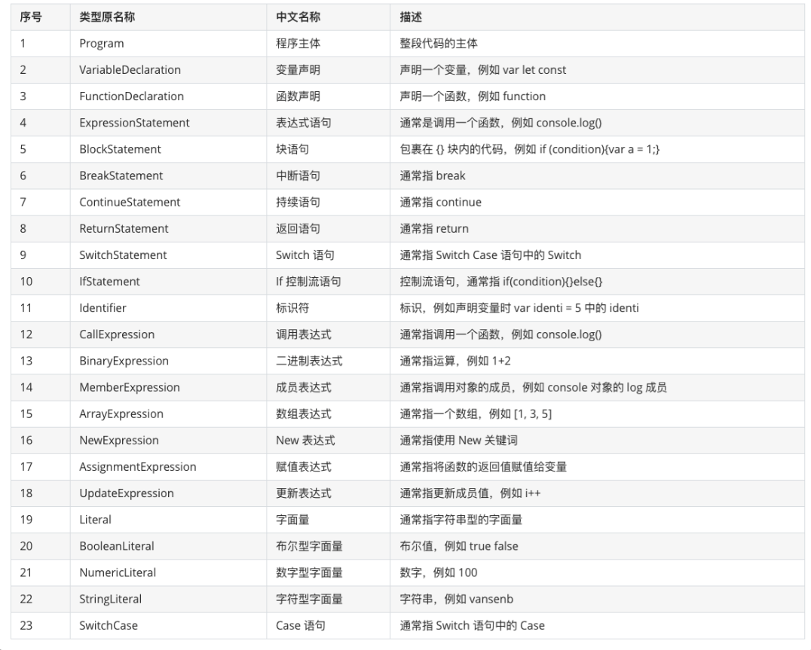

# AST 抽象语法树

> 源代码语法结构的一种抽象表示。它以树状的形式表现编程语言的语法结构，树上的每个节点都表示源代码中的一种结构。

- [参考1](https://juejin.im/post/5d9ed72b6fb9a04e3043d36e)
- [参考2](https://juejin.im/post/5d50d1d9f265da03aa25607b?utm_source=gold_browser_extension)

- [分词](https://esprima.org/demo/parse.html)
- [AST](https://astexplorer.net/)

- 用途：IDE 提示，高亮等；webpack; TS等
- js parser过程：分词 + 语法分析
  - 分词：将整个代码字符串分割成最小语法单元数组
  - 语法分析：在分词基础上建立分析语法单元之间的关系，对语句和表达式识别，确定之前的关系，这是个递归过程

Javascript 代码中的语法单元主要包括以下这么几种：ß

- 关键字：例如 var、let、const等
- 标识符：没有被引号括起来的连续字符，可能是一个变量，也可能是 if、else 这些关键字，又或者是 true、false 这些内置常量
- 运算符： +、-、 *、/ 等
- 数字：像十六进制，十进制，八进制以及科学表达式等语法
- 字符串：因为对计算机而言，字符串的内容会参与计算或显示
- 空格：连续的空格，换行，缩进等
- 注释：行注释或块注释都是一个不可拆分的最小语法单元
- 其他：大括号、小括号、分号、冒号等



```js
var a = 1;

// => AST
/**
 * ! 分词
 * [
    {
        "type": "Keyword",
        "value": "var"
    },
    {
        "type": "Identifier",
        "value": "a"
    },
    {
        "type": "Punctuator",
        "value": "="
    },
    {
        "type": "Numeric",
        "value": "1"
    },
    {
        "type": "Punctuator",
        "value": ";"
    }
  ]

  * ! AST
  {
    "type": "Program",
    "body": [
        {
            "type": "VariableDeclaration",
            "declarations": [
                {
                    "type": "VariableDeclarator",
                    "id": {
                        "type": "Identifier",
                        "name": "a"
                    },
                    "init": {
                        "type": "Literal",
                        "value": 1,
                        "raw": "1"
                    }
                }
            ],
            "kind": "var"
        }
    ],
    "sourceType": "script"
  }
 */
```

## 工具

- @babel/parser：用于把 JS 源码转化成 AST；
- @babel/traverse：用于遍历 AST 树，获取当中的节点内容；
- @babel/generator：把 AST 节点转化成对应的 JS 代码；
- @babel/types：新建 AST 节点。
