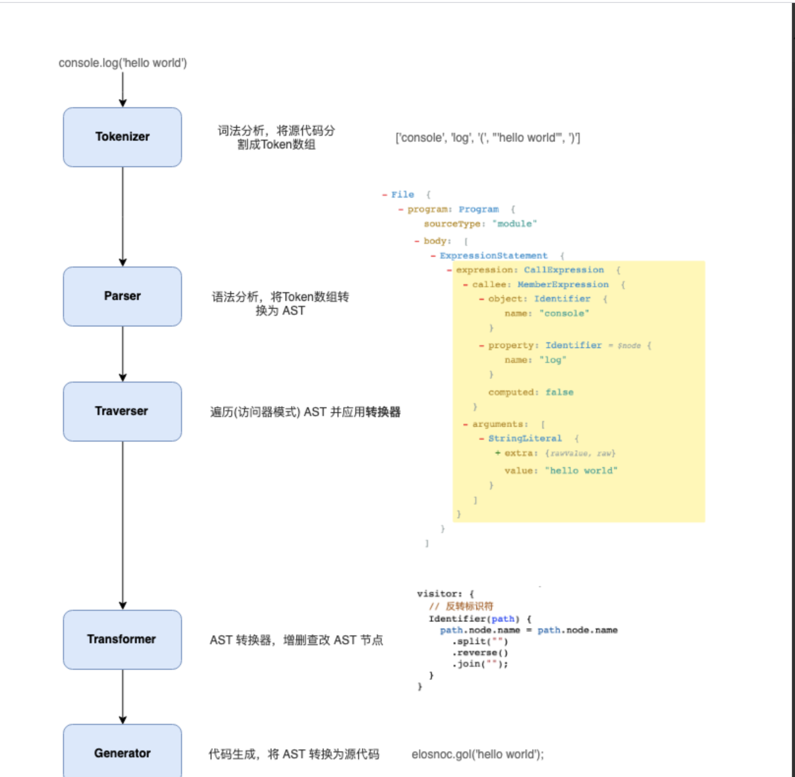
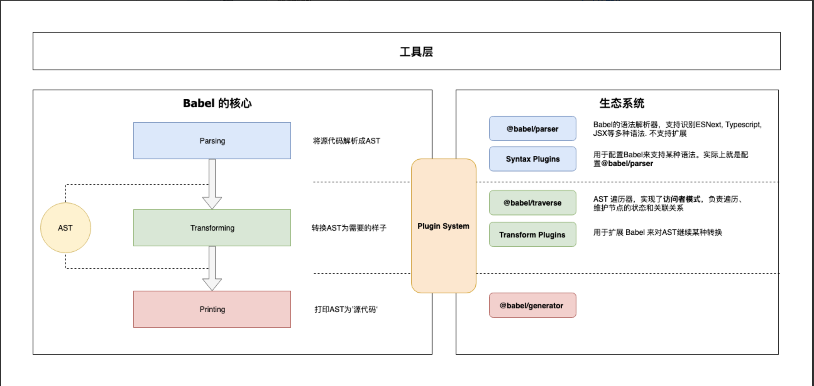

# babel

> babel 介绍

参考：

- [babel 中文网](https://www.babeljs.cn/)

## 处理流程

## 架构

### 核心

> @babel/core

- 加载和处理配置(config)
- 加载插件
- 调用 Parser 进行语法解析，生成 AST
- 调用 Traverser 遍历AST，并使用访问者模式应用'插件'对 AST 进行转换
- 生成代码，包括SourceMap转换和源代码生成

### 核心周边支撑

- Parser(@babel/parser)： 将源代码解析为 AST 就靠它了。 它已经内置支持很多语法. 例如 JSX、Typescript、Flow、以及最新的ECMAScript规范。目前为了执行效率，parser是不支持扩展的，由官方进行维护。如果你要支持自定义语法，可以 fork 它，不过这种场景非常少。
- Traverser(@babel/traverse)：  实现了访问者模式，对 AST 进行遍历，转换插件会通过它获取感兴趣的AST节点，对节点继续操作, 下文会详细介绍访问器模式。
- Generator(@babel/generator)： 将 AST 转换为源代码，支持 SourceMap

### 插件

> 按类型分类，注意插件定义引用顺序

- **语法插件(@babel/plugin-syntax-xx)**：上面说了 @babel/parser 已经支持了很多 JavaScript 语法特性，Parser也不支持扩展. 因此plugin-syntax-*实际上只是用于开启或者配置Parser的某个功能特性。
一般用户不需要关心这个，Transform 插件里面已经包含了相关的plugin-syntax-*插件了。用户也可以通过parserOpts配置项来直接配置 Parser

- **转换插件**： 用于对 AST 进行转换, 实现转换为ES5代码、压缩、功能增强等目的. Babel仓库将转换插件划分为两种(只是命名上的区别)：
@babel/plugin-transform-*： 普通的转换插件
@babel/plugin-proposal-*： 还在'提议阶段'(非正式)的语言特性, 目前有这些

- **预定义集合(@babel/presets-xx)**： 插件集合或者分组，主要方便用户对插件进行管理和使用。比如preset-env含括所有的标准的最新特性; 再比如preset-react含括所有react相关的插件.

### 插件开发辅助

- @babel/template： 某些场景直接操作AST太麻烦，就比如我们直接操作DOM一样，所以Babel实现了这么一个简单的模板引擎，可以将字符串代码转换为AST。比如在生成一些辅助代码(helper)时会用到这个库
- @babel/types： AST 节点构造器和断言. 插件开发时使用很频繁
- @babel/helper-*： 一些辅助器，用于辅助插件开发，例如简化AST操作
- @babel/helper： 辅助代码，单纯的语法转换可能无法让代码运行起来,比如低版本浏览器无法识别class关键字，这时候需要添加辅助代码，对class进行模拟。

### 工具

- @babel/node： Node.js CLI, 通过它直接运行需要 Babel 处理的JavaScript文件
- @babel/register： Patch NodeJs 的require方法，支持导入需要Babel处理的JavaScript模块
- @babel/cli： CLI工具

## 自定义插件

- [类 babel-plugin-import](https://juejin.im/post/5d94bfbf5188256db95589be#heading-7)
