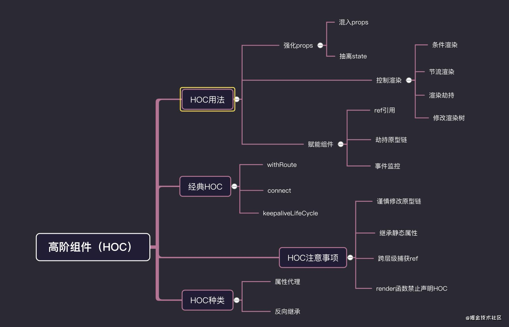

# React HOC

> React高阶组件(HOC), 高阶作用用于强化组件，复用逻辑，提升渲染性能等作用

## 简介

高阶组件（HOC）是 React 中用于复用组件逻辑的一种高级技巧。HOC 自身不是 React API 的一部分，它是一种基于 React 的组合特性而形成的**设计模式**。



## 背景

> 早期React项目开发也有一些包装强化组件的方式，但都有一些优缺点

### 方式

**mixins**: 混入模式，通过`React.createClass`,加入`mixins`属性

```js
const customMixin = {
  componentDidMount(){
    console.log( '------componentDidMount------' )
  },
  say(){
    console.log(this.state.name)
  }
}

// createClass模式
const APP = React.createClass({
  mixins: [ customMixin ],
  getInitialState(){
    return {
      name:'alien'
    }
  },
  render(){
    const { name  } = this.state
    return <div> hello ,world , my name is { name } </div>
  }
})

// 原型链模式
function componentClassMixins(Component,mixin){ /* 继承 */
  for(let key in mixin){
    Component.prototype[key] = mixin[key]
  }
}

class Index extends React.Component{
  constructor(){
    super()
    this.state={  name:'alien' }
  }
  render(){
    return <div> hello,world
      <button onClick={ this.say.bind(this) } > to say </button>
    </div>
  }
}
componentClassMixins(Index,customMixin)
```

这种`mixins`只能存在`createClass`中，后来`React.createClass`连同`mixins`这种模式被废弃了。`mixins`会带来一些负面的影响。

- 1 `mixin`引入了隐式依赖关系。
- 2 不同`mixins`之间可能会有先后顺序甚至代码冲突覆盖的问题
- 3 `mixin`代码会导致滚雪球式的复杂性

**extends**: 继承模式，可以封装基础功能组件，然后根据需要去`extends`我们的基础组件，按需强化组件

```js
class Base extends React.Component{
  constructor(){
    super()
    this.state={
      name:'alien'
    }
  }
  say(){
    console.log('base components')
  }
  render(){
    return <div> hello,world <button onClick={ this.say.bind(this) } >点击</button>  </div>
  }
}
class Index extends Base{
  componentDidMount(){
    console.log( this.state.name )
  }
  say(){ /* 会覆盖基类中的 say  */
    console.log('extends components')
  }
}
export default Index
```

**HOC**: 高阶组件模式

```js
function HOC(Component) {
  return class wrapComponent extends React.Component{
     constructor(){
       super()
       this.state={
         name:'alien'
       }
     }
     render=()=><Component { ...this.props } { ...this.state } />
  }
}

// 装饰器语法糖
@HOC
class Index extends React.Component{
  say(){
    const { name } = this.props
    console.log(name)
  }
  render(){
    return <div> hello,world <button onClick={ this.say.bind(this) } >点击</button>  </div>
  }
}

```

**hooks**：react-hooks 模式, hooks的诞生，一大部分原因是解决无状态组件没有state和逻辑难以复用问题

```js

import React , { useState } from 'react'
/* 自定义hooks 用于格式化数组将小写转成大写 */
function useFormatList(list){
   return list.map(item=>{
       console.log(1111)
       return item.toUpperCase()
   })
}
/* 父组件传过来的list = [ 'aaa' , 'bbb' , 'ccc'  ] */
function index({ list }){
   const [ number ,setNumber ] = useState(0)
   const newList = useFormatList(list)
   return <div>
       <div className="list" >
          { newList.map(item=><div key={item} >{ item }</div>) }
        </div>
        <div className="number" >
            <div>{ number }</div>
            <button onClick={()=> setNumber(number + 1) } >add</button>
        </div>
   </div>
}
export default index

```

### HOC产生初衷

- `复用逻辑`：高阶组件更像是一个加工react组件的工厂，批量对原有组件进行加工，包装处理。可以根据业务需求定制化专属的HOC, 这样可以解决复用逻辑
- `强化props`: 这个是HOC最常用的用法之一，高阶组件返回的组件，可以劫持上一层传过来的props,然后混入新的props,来增强组件的功能。代表作react-router中的withRouter
- `赋能组件`: HOC有一项独特的特性，就是可以给被HOC包裹的业务组件，提供一些拓展功能，比如说额外的生命周期，额外的事件，但是这种HOC，可能需要和业务组件紧密结合
- `控制渲染`: 劫持渲染是hoc一个特性，在wrapComponent包装组件中，可以对原来的组件，进行条件渲染，节流渲染，懒加载等功能。典型代表做react-redux中connect和 dva中 dynamic 组件懒加载

使用方式：`装饰器模式`和`函数包裹模式`

嵌套HOC:

```js
function withRouter(){
    return class wrapComponent extends React.Component{
        /* 编写逻辑 */
    }
}

function connect (mapStateToProps){
    /* 接受第一个参数 */
    return function connectAdvance(wrapCompoent){
        /* 接受组件 */
        return class WrapComponent extends React.Component{  }
    }
}

```

## HOC类型

### 强化props

**混入props**: 承接上层的props,在混入自己的props，来强化组件

```js
function classHOC(WrapComponent){
    return class  Idex extends React.Component{
        state={
            name:'alien'
        }
        componentDidMount(){
           console.log('HOC')
        }
        render(){
            return <WrapComponent { ...this.props }  { ...this.state }   />
        }
    }
}
function Index(props){
  const { name } = props
  useEffect(()=>{
     console.log( 'index' )
  },[])
  return <div>
    hello,world , my name is { name }
  </div>
}

export default classHOC(Index)

// 无状态组件HOC
function functionHoc(WrapComponent){
    return function Index(props){
        const [ state , setState ] = useState({ name :'alien'  })       
        return  <WrapComponent { ...props }  { ...state }   />
    }
}

```

**抽离state控制更新**：高阶组件可以将HOC的state的配合起来，控制业务组件的更新。这种用法在react-redux中connect高阶组件中用到过，用于处理来自redux中state更改，带来的订阅更新作用

```js
function classHOC(WrapComponent){
  return class  Idex extends React.Component{
      constructor(){
        super()
        this.state={
          name:'alien'
        }
      }
      changeName(name){
        // 控制state
        this.setState({ name })
      }
      render(){
          return <WrapComponent { ...this.props }  { ...this.state } changeName={this.changeName.bind(this)  }  />
      }
  }
}
function Index(props){
  const [ value ,setValue ] = useState(null)
  const { name ,changeName } = props
  return <div>
    <div>   hello,world , my name is { name }</div>
    改变name <input onChange={ (e)=> setValue(e.target.value)  }  />
    <button onClick={ ()=>  changeName(value) }  >确定</button>
  </div>
}

export default classHOC(Index)

```

### 控制渲染

#### 条件渲染

- **动态渲染**：对于属性代理的高阶组件，虽然不能在内部操控渲染状态，但是可以在外层控制当前组件是否渲染，这种情况应用于，`权限隔离，懒加载 ，延时加载`等场景

```js
function renderHOC(WrapComponent){
  return class Index  extends React.Component{
      constructor(props){
        super(props)
        this.state={ visible:true }  
      }
      setVisible(){
         this.setState({ visible:!this.state.visible })
      }
      render(){
         const {  visible } = this.state 
         return <div className="box"  >
           <button onClick={ this.setVisible.bind(this) } > 挂载组件 </button>
           { visible ? <WrapComponent { ...this.props } setVisible={ this.setVisible.bind(this) }   />  : <div className="icon" ><SyncOutlined spin  className="theicon"  /></div> }
         </div>
      }
  }
}

class Index extends React.Component{
  render(){
    const { setVisible } = this.props
    return <div className="box" >
        <p>hello,my name is alien</p>
         
        <button onClick={() => setVisible()}  > 卸载当前组件 </button>
    </div>
  }
}
export default renderHOC(Index)
```

- **分片渲染**: 实现一个懒加载功能的HOC，可以实现组件的分片渲染,用于分片渲染页面，不至于一次渲染大量组件造成白屏效果

```js
const renderQueue = []
let isFirstrender = false

const tryRender = ()=>{
  const render = renderQueue.shift()
  if(!render) return
  setTimeout(()=>{
    render() /* 执行下一段渲染 */
  },300)
} 
/* HOC */
function renderHOC(WrapComponent){
    return function Index(props){
      const [ isRender , setRender ] = useState(false)
      useEffect(()=>{
        renderQueue.push(()=>{  /* 放入待渲染队列中 */
          setRender(true)
        })
        if(!isFirstrender) {
          tryRender() /**/
          isFirstrender = true
        }
      },[])
      return isRender ? <WrapComponent tryRender={tryRender}  { ...props }  /> : <div className='box' ><div className="icon" ><SyncOutlined   spin /></div></div>
    }
}
/* 业务组件 */
class Index extends React.Component{
  componentDidMount(){
    const { name , tryRender} = this.props
    /* 上一部分渲染完毕，进行下一部分渲染 */
    tryRender()
    console.log( name+'渲染')
  }
  render(){
    return <div>
        
    </div>
  }
}
/* 高阶组件包裹 */
const Item = renderHOC(Index)

export default () => {
  return <React.Fragment>
      <Item name="组件一" />
      <Item name="组件二" />
      <Item name="组件三" />
  </React.Fragment>
}
```

- **异步组件**：懒加载, dva里面的dynamic就是应用HOC模式实现的组件异步加载

```js
/* 路由懒加载HOC */
export default function AsyncRouter(loadRouter) {
  return class Content extends React.Component {
    state = {Component: null}
    componentDidMount() {
      if (this.state.Component) return
      loadRouter()
        .then(module => module.default)
        .then(Component => this.setState({Component},
         ))
    }
    render() {
      const {Component} = this.state
      return Component ? <Component {
      ...this.props
      }
      /> : null
    }
  }
}

const Index = AsyncRouter(()=>import('../pages/index'))

```

- **反向继承**：渲染劫持；HOC反向继承模式，可以实现颗粒化的渲染劫持，也就是可以控制基类组件的render函数，还可以篡改props，或者是children

```js

const HOC = (WrapComponent) =>
  class Index  extends WrapComponent {
    render() {
      if (this.props.visible) {
        return super.render()
      } else {
        return <div>暂无数据</div>
      }
    }
  }

```

修改渲染树: 修改渲染状态(劫持render替换子节点)

```js
class Index extends React.Component{
  render(){
    return <div>
       <ul>
         <li>react</li>
         <li>vue</li>
         <li>Angular</li>
       </ul>
    </div>
  }
}

function HOC (Component){
  return class Advance extends Component {
    render() {
      const element = super.render()
      const otherProps = {
        name:'alien'
      }
      /* 替换 Angular 元素节点 偷天换日 */
      const appendElement = React.createElement('li' ,{} , `hello ,world , my name  is ${ otherProps.name }` )
      const newchild =  React.Children.map(element.props.children.props.children,(child,index)=>{
           if(index === 2) return appendElement
           return  child
      }) 
      return  React.cloneElement(element, element.props, newchild)
    }
  }
}
export  default HOC(Index)

```

#### 节流渲染

- **基础节流**：配合hooks的useMemo等API配合使用, 减少渲染次数，达到优化性效果

```js
function HOC (Component){
     return function renderWrapComponent(props){
       const { num } = props
       // 控制渲染
       const RenderElement = useMemo(() =>  <Component {...props}  /> ,[ num ])
       return RenderElement
     }
}
class Index extends React.Component{
  render(){
     console.log(`当前组件是否渲染`,this.props)
     return <div>hello,world, my name is alien </div>
  }
}
const IndexHoc = HOC(Index)

export default ()=> {
    const [ num ,setNumber ] = useState(0)
    const [ num1 ,setNumber1 ] = useState(0)
    const [ num2 ,setNumber2 ] = useState(0)
    return <div>
        <IndexHoc  num={ num } num1={num1} num2={ num2 }  />
        <button onClick={() => setNumber(num + 1) } >num++</button>
        <button onClick={() => setNumber1(num1 + 1) } >num1++</button>
        <button onClick={() => setNumber2(num2 + 1) } >num2++</button>
    </div>
}
```

进阶，传递依赖控制渲染

```js
function HOC (rule){
     return function (Component){
        return function renderWrapComponent(props){
          const dep = rule(props) // 依赖
          const RenderElement = useMemo(() =>  <Component {...props}  /> ,[ dep ])
          return RenderElement
        }
     }
}
/* 只有 props 中 num 变化 ，渲染组件  */
@HOC( (props)=> props['num'])
class IndexHoc extends React.Component{
  render(){
     console.log(`组件一渲染`,this.props)
     return <div> 组件一 ： hello,world </div>
  }
}

/* 只有 props 中 num1 变化 ，渲染组件  */
@HOC((props)=> props['num1'])
class IndexHoc1 extends React.Component{
  render(){
     console.log(`组件二渲染`,this.props)
     return <div> 组件二 ： my name is alien </div>
  }
}
export default ()=> {
    const [ num ,setNumber ] = useState(0)
    const [ num1 ,setNumber1 ] = useState(0)
    const [ num2 ,setNumber2 ] = useState(0)
    return <div>
        <IndexHoc  num={ num } num1={num1} num2={ num2 }  />
        <IndexHoc1  num={ num } num1={num1} num2={ num2 }  />
        <button onClick={() => setNumber(num + 1) } >num++</button>
        <button onClick={() => setNumber1(num1 + 1) } >num1++</button>
        <button onClick={() => setNumber2(num2 + 1) } >num2++</button>
    </div>
}
```

### 赋能组件

高阶组件除了上述两种功能之外，还可以赋能组件，比如加一些额外生命周期，劫持事件，监控日志等等。

#### 劫持原型链-劫持生命周期，事件函数

- 属性代理实现

```js
function HOC (Component){
  const proDidMount = Component.prototype.componentDidMount 
  Component.prototype.componentDidMount = function(){
     console.log('劫持生命周期：componentDidMount')
     proDidMount.call(this)
  }
  return class wrapComponent extends React.Component{
      render(){
        return <Component {...this.props}  />
      }
  }
}
@HOC
class Index extends React.Component{
   componentDidMount(){
     console.log('———didMounted———')
   }
   render(){
     return <div>hello,world</div>
   }
}
```

- 反向继承实现: 可以对原有组件的生命周期或事件进行劫持，甚至是替换。

```js
function HOC (Component){
  const didMount = Component.prototype.componentDidMount
  return class wrapComponent extends Component{
      componentDidMount(){
        console.log('------劫持生命周期------')
        if (didMount) {
           didMount.apply(this) /* 注意 `this` 指向问题。 */
        }
      }
      render(){
        return super.render()
      }
  }
}

@HOC
class Index extends React.Component{
   componentDidMount(){
     console.log('———didMounted———')
   }
   render(){
     return <div>hello,world</div>
   }
}

```

#### 事件监控

HOC还可以对原有组件进行监控。比如对一些事件监控，错误监控，事件监听等一系列操作。

```js

function ClickHoc (Component){
  return  function Wrap(props){
    const dom = useRef(null)
    useEffect(()=>{
     const handerClick = () => console.log('发生点击事件') 
     dom.current.addEventListener('click',handerClick)
     return () => dom.current.removeEventListener('click',handerClick)
    },[])
    return  <div ref={dom}  ><Component  {...props} /></div>
  }
}

@ClickHoc
class Index extends React.Component{
   render(){
     return <div  className='index'  >
       <p>hello，world</p>
       <button>组件内部点击</button>
    </div>
   }
}
export default ()=>{
  return <div className='box'  >
     <Index />
     <button>组件外部点击</button>
  </div>
}

```

## 总结

> hoc主要功能，强化props ， 控制渲染 ，赋能组件

对于**属性代理HOC**，我们可以：

- 强化props & 抽离state。
- 条件渲染，控制渲染，分片渲染，懒加载。
- 劫持事件和生命周期
- ref控制组件实例
- 添加事件监听器，日志

对于**反向代理的HOC**,我们可以：

- 劫持渲染，操纵渲染树
- 控制/替换生命周期，直接获取组件状态，绑定事件。

### 注意

- 谨慎修改原型链，可能产生副作用
- 继承静态属性丢失问题： 手动去添加继承
- 跨层级捕获ref： 因为 ref 实际上并不是一个 prop - 就像 key 一样，它是由 React 专门处理的。如果将 ref 添加到 HOC 的返回组件中，则 ref 引用指向容器组件，而不是被包装组件。我们可以通过`forwardRef`来解决这个问题。

```js
/**
 * 
 * @param {*} Component 原始组件
 * @param {*} isRef  是否开启ref模式
 */
function HOC(Component,isRef){
  class Wrap extends React.Component{
     render(){
        const { forwardedRef ,...otherprops  } = this.props
        return <Component ref={forwardedRef}  {...otherprops}  />
     }
  }
    if(isRef){
      return  React.forwardRef((props,ref)=> <Wrap forwardedRef={ref} {...props} /> )
    }
    return Wrap
}

class Index extends React.Component{
  componentDidMount(){
      console.log(666)
  }
  render(){
    return <div>hello,world</div>
  }
}

const HocIndex =  HOC(Index,true)

export default ()=>{
  const node = useRef(null)
  useEffect(()=>{
     /* 就可以跨层级，捕获到 Index 组件的实例了 */ 
    console.log(node.current.componentDidMount)
  },[])
  return <div><HocIndex ref={node}  /></div>
}
```

- render中不要声明HOC，正确做法动态绑定HOC

```js
const WrapHome = HOC(Home)
class index extends React.Component{
  render(){
     return <WrapHome />
  }
}
```
