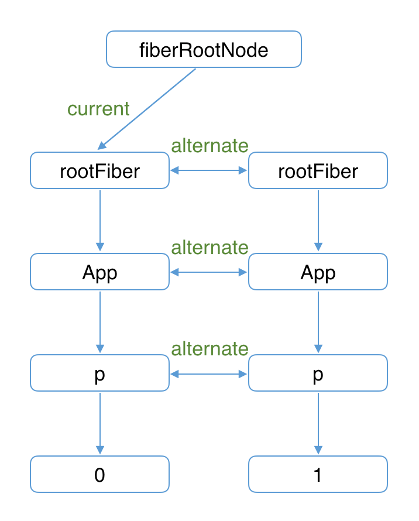

# 原理&实现

> 学之，用之，知其然知其所以然 ⛳

## 参考

- [React技术揭秘](https://github.com/BetaSu/just-react)

## 理念背景

> 用于构建用户界面的 JavaScript 库， 构建**快速响应**的大型 Web 应用程序

相比于新增feature，React更在意底层抽象的表现力

- **jsx灵活性，缺少编译时的优化手段**，需求更多其他手段来加快渲染速度
  - 使用PureComponent或React.memo构建组件
  - 使用shouldComponentUpdate生命周期钩子
  - 渲染列表时使用key
  - 使用useCallback和useMemo缓存函数和变量
  - 等等更多
- 将同步的更新变为**可中断的异步更新**，优先更新交互高优先级的更新，人机交互体验是更自然的。

## React16之前的架构

### React15架构

- Reconciler（协调器）—— 负责找出变化的组件
- Renderer（渲染器）—— 负责将变化的组件渲染到页面上

#### Reconciler（协调器）

> 在React中可以通过this.setState、this.forceUpdate、ReactDOM.render等API触发更新。

- 调用函数组件、或class组件的render方法，将返回的JSX转化为虚拟DOM
- 将虚拟DOM和上次更新时的虚拟DOM对比
- 通过对比找出本次更新中变化的虚拟DOM
- 通知Renderer将变化的虚拟DOM渲染到页面上

#### Renderer（渲染器）

> 由于React支持跨平台，所以不同平台有不同的Renderer。我们前端最熟悉的是负责在浏览器环境渲染的Renderer —— ReactDOM 。

- ReactNative 渲染器，渲染App原生组件
- ReactTest 渲染器，渲染出纯Js对象用于测试
- ReactArt 渲染器，渲染到Canvas, SVG 或 VML (IE8)

在每次更新发生时，Renderer接到Reconciler通知，将变化的组件渲染在当前宿主环境。

### React15架构的缺点

> 在Reconciler中，mount的组件会调用mountComponent ，update的组件会调用updateComponent。这两个方法都会递归更新子组件

主流的浏览器刷新频率为60Hz，即每（1000ms / 60Hz）16.6ms浏览器刷新一次。我们知道，**JS可以操作DOM，GUI渲染线程与JS线程是互斥的。所以JS脚本执行和浏览器布局、绘制不能同时执行**。

在每16.6ms时间内，需要完成如下工作：

`JS脚本执行 -----  样式布局 ----- 样式绘制`

当JS执行时间过长，超出了16.6ms，这次刷新就没有时间执行样式布局和样式绘制了。

对于用户在输入框输入内容这个行为来说，就体现为按下了键盘按键但是页面上不实时显示输入。

对于React的更新来说，**由于递归执行，所以更新一旦开始，中途就无法中断。当层级很深时，递归更新时间超过了16ms，用户交互就会卡顿**。

## React16架构

> [官网-源码概述](https://zh-hans.reactjs.org/docs/codebase-overview.html)

- Scheduler（调度器）—— 调度任务的优先级，高优任务优先进入Reconciler
- Reconciler（协调器）—— 负责找出变化的组件
- Renderer（渲染器）—— 负责将变化的组件渲染到页面上

Reconciler工作的阶段被称为render阶段。因为在该阶段会调用组件的render方法。
Renderer工作的阶段被称为commit阶段。就像你完成一个需求的编码后执行git commit提交代码。commit阶段会把render阶段提交的信息渲染在页面上。
render与commit阶段统称为work，即React在工作中。相对应的，如果任务正在Scheduler内调度，就不属于work。

### Scheduler（调度器）

> [Scheduler](https://github.com/facebook/react/tree/1fb18e22ae66fdb1dc127347e169e73948778e5a/packages/scheduler) 是独立于React的库

既然我们以浏览器是否有剩余时间作为任务中断的标准，那么我们需要一种机制，当浏览器有剩余时间时通知我们。

其实部分浏览器已经实现了这个API，这就是`requestIdleCallback`。但是由于以下因素，React放弃使用：

- 浏览器兼容性
- 触发频率不稳定，受很多因素影响。比如当我们的浏览器切换tab后，之前tab注册的requestIdleCallback触发的频率会变得很低

基于以上原因，React实现了功能更完备的`requestIdleCallback` polyfill，这就是`Scheduler`。除了在空闲时触发回调的功能外，Scheduler还提供了多种调度优先级供任务设置。

### 16-Reconciler（协调器）

> 相比之前，更新工作从递归变成了可以中断的循环过程。每次循环都会调用shouldYield判断当前是否有剩余时间。

```js
/** @noinline */
function workLoopConcurrent() {
  // Perform work until Scheduler asks us to yield
  while (workInProgress !== null && !shouldYield()) {
    workInProgress = performUnitOfWork(workInProgress);
  }
}
```

那么React16是如何解决中断更新时DOM渲染不完全的问题呢❓

在React16中，Reconciler与Renderer不再是交替工作。当Scheduler将任务交给Reconciler后，Reconciler会为变化的虚拟DOM打上代表增/删/更新的标记，类似这样：

```js
export const Placement = /*             */ 0b0000000000010;
export const Update = /*                */ 0b0000000000100;
export const PlacementAndUpdate = /*    */ 0b0000000000110;
export const Deletion = /*              */ 0b0000000001000;
```

全部的标记见[这里](https://github.com/facebook/react/blob/1fb18e22ae66fdb1dc127347e169e73948778e5a/packages/react-reconciler/src/ReactSideEffectTags.js)

整个Scheduler与Reconciler的工作都在内存中进行。只有当所有组件都完成Reconciler的工作，才会统一交给Renderer。

### 16-Renderer（渲染器）

Renderer根据Reconciler为虚拟DOM打的标记，同步执行对应的DOM操作

在React16架构中整个更新流程为：


其中红框中的步骤随时可能由于以下原因被中断：

- 有其他更高优任务需要先更新
- 当前帧没有剩余时间

由于红框中的工作都在内存中进行，不会更新页面上的DOM，所以即使反复中断，用户也不会看见更新不完全的DOM。

## Fiber 架构

> React内部实现的一套状态更新机制。支持任务不同优先级，可中断与恢复，并且恢复后可以复用之前的中间状态; 其中每个任务更新单元为`React Element`对应的`Fiber`节点。

- React16虚拟DOM在React中有个正式的称呼——Fiber

- Fiber节点构成的Fiber树就对应DOM树。

### 代数效应

> 代数效应是函数式编程中的一个概念，用于将副作用从函数调用中分离, 使函数关注点保持纯粹。

对于类似`useState、useReducer、useRef`这样的`Hook`，我们不需要关注`FunctionComponent`的`state`在`Hook`中是如何保存的，React会为我们处理。

从React15到React16，协调器（Reconciler）重构的一大目的是：**将老的同步更新的架构变为异步可中断更新**。

**异步可中断更新可以理解**为：更新在执行过程中可能会被打断（浏览器时间分片用尽或有更高优任务插队），当可以继续执行时恢复之前执行的中间状态。

这就是代数效应的作用。

其实，浏览器原生就支持类似的实现，这就是`Generator`。

但是`Generator`的一些缺陷使React团队放弃了他：

- 类似async，Generator也是传染性的，使用了Generator则上下文的其他函数也需要作出改变。这样心智负担比较重。
- Generator执行的中间状态是上下文关联的, 高优先级任务插队, 无法复用之前已经计算出的x，需要重新计算, 如果通过全局变量保存之前执行的中间状态，又会引入新的复杂度。

### Fiber 实现

Fiber节点的属性定义

```js
function FiberNode(
  tag: WorkTag,
  pendingProps: mixed,
  key: null | string,
  mode: TypeOfMode,
) {
  // 作为静态数据结构的属性
  this.tag = tag; // Fiber对应组件的类型 Function/Class/HostComponent
  this.key = key; // key属性
  this.elementType = null; // 大部分情况同type，某些情况不同，比如FunctionComponent使用React.memo包裹
  this.type = null; // 对于 FunctionComponent，指函数本身，对于ClassComponent，指class，对于HostComponent，指DOM节点tagName
  this.stateNode = null; // Fiber对应的真实DOM节点

  // 用于连接其他Fiber节点形成Fiber树
  this.return = null; // 指向父级Fiber节点
  this.child = null; // 指向子Fiber节点
  this.sibling = null; // 指向右边第一个兄弟Fiber节点
  this.index = 0;

  this.ref = null;

  // 作为动态的工作单元的属性
  this.pendingProps = pendingProps;
  this.memoizedProps = null;
  this.updateQueue = null;
  this.memoizedState = null;
  this.dependencies = null;

  this.mode = mode;

  this.effectTag = NoEffect;
  this.nextEffect = null;

  this.firstEffect = null;
  this.lastEffect = null;

  // 调度优先级相关
  this.lanes = NoLanes;
  this.childLanes = NoLanes;

  // 指向该fiber在另一次更新时对应的fiber
  this.alternate = null;
}
```

### 双缓存Fiber树

> 这种在内存中构建并直接替换的技术叫做**双缓存**。React使用“双缓存”来完成Fiber树的构建与替换——对应着DOM树的创建与更新

- `current Fiber`: 当前屏幕上显示内容对应的Fiber树
- `workInProgress Fiber`: 正在内存中构建的Fiber树

`current Fiber`树中的Fiber节点被称为`current fiber`，`workInProgress Fiber`树中的Fiber节点被称为`workInProgress fiber`，他们通过alternate属性连接。

```js
currentFiber.alternate === workInProgressFiber;
workInProgressFiber.alternate === currentFiber;
```

当`workInProgress Fiber`树构建完成交给Renderer渲染在页面上后，应用根节点的current指针指向`workInProgress Fiber`树，此时`workInProgress Fiber`树就变为current Fiber树。

每次状态更新都会产生新的`workInProgress Fiber`树，通过current与workInProgress的替换，完成DOM更新。

## mount时

```js
function App() {
  const [num, add] = useState(0);
  return (
    <p onClick={() => add(num + 1)}>{num}</p>
  )
}

ReactDOM.render(<App/>, document.getElementById('root'));
```

1、首次执行ReactDOM.render会创建`fiberRootNode`（源码中叫`fiberRoot`）和`rootFiber`。其中fiberRootNode是整个应用的根节点，rootFiber是`<App/>`所在组件树的根节点。
之所以要区分fiberRootNode与rootFiber，是因为**在应用中我们可以多次调用ReactDOM.render渲染不同的组件树，他们会拥有不同的rootFiber。但是整个应用的根节点只有一个，那就是fiberRootNode。**

fiberRootNode的current会指向当前页面上已渲染内容对应对Fiber树(rootFiber)，被称为current Fiber树。

`fiberRootNode.current = rootFiber;`

2、接下来进入render阶段，根据组件返回的JSX在内存中依次创建Fiber节点并连接在一起构建Fiber树，被称为`workInProgress Fiber树`。
在构建workInProgress Fiber树时会尝试复用current Fiber树中已有的Fiber节点内的属性，在首屏渲染时只有rootFiber存在对应的current fiber（即`rootFiber.alternate`）。

3、图中右侧已构建完的workInProgress Fiber树在commit阶段渲染到页面。
此时DOM更新为右侧树对应的样子。**fiberRootNode的current指针指向workInProgress Fiber树使其变为current Fiber 树**。

## update时

1、接下来我们点击p节点触发状态改变，这会开启一次新的render阶段并构建一棵新的workInProgress Fiber 树。和mount时一样，workInProgress fiber的创建可以复用current Fiber树对应的节点数据。

> 这个决定是否复用的过程就是Diff算法



2、workInProgress Fiber 树在render阶段完成构建后进入commit阶段渲染到页面上。渲染完毕后，workInProgress Fiber 树变为current Fiber 树
