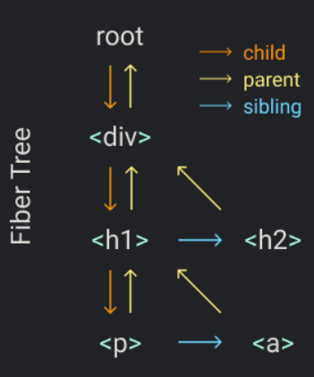

# React-Own

> 自定义简单React

```js

const element = <h1 title="foo">Hello</h1>
const container = document.getElementById("root")
ReactDOM.render(element, container)

// => 编译

const element = {
  type: "h1",
  props: {
    title: "foo",
    children: "Hello",
  },
}
​
const container = document.getElementById("root")
​
const node = document.createElement(element.type)
node["title"] = element.props.title
​
const text = document.createTextNode("")
text["nodeValue"] = element.props.children
​
node.appendChild(text)
container.appendChild(node)
```


