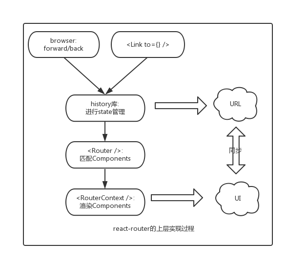

# history

> 历史浏览记录管理，兼容不同环境、浏览器

- 老浏览器的history: 主要通过hash来实现，对应`createHashHistory`
- 高版本浏览器: 通过html5里面的history，对应`createBrowserHistory`
- node环境下: 主要存储在内存memeory里面，对应`createMemoryHistory`

```js
// 内部的抽象实现
function createHistory(options={}) {
  ...
  return {
    listenBefore, // 内部的hook机制，可以在location发生变化前执行某些行为，AOP的实现
    listen, // location发生改变时触发回调
    transitionTo, // 执行location的改变
    push, // 改变location
    replace,
    go,
    goBack,
    goForward,
    createKey, // 创建location的key，用于唯一标示该location，是随机生成的
    createPath,
    createHref,
    createLocation, // 创建location
  }
}

function createLocation() {
  return {
    pathname, // url的基本路径
    search, // 查询字段
    hash, // url中的hash值
    state, // url对应的state字段
    action, // 分为 push、replace、pop三种
    key // 生成方法为: Math.random().toString(36).substr(2, length)
  }
}
```

### URL前进

- createBrowserHistory: pushState、replaceState
- createHashHistory: location.hash=*** location.replace()
- createMemoryHistory: 在内存中进行历史记录的存储

```js
// createBrowserHistory(HTML5)中的前进实现
function finishTransition(location) {
  ...
  const historyState = { key };
  ...
  if (location.action === 'PUSH') ) {
    window.history.pushState(historyState, null, path);
  } else {
    window.history.replaceState(historyState, null, path)
  }
}
// createHashHistory的内部实现
function finishTransition(location) {
  ...
  if (location.action === 'PUSH') ) {
    window.location.hash = path;
  } else {
    window.location.replace(
    window.location.pathname + window.location.search + '#' + path
  );
  }
}
// createMemoryHistory的内部实现
entries = [];
function finishTransition(location) {
  ...
  switch (location.action) {
    case 'PUSH':
      entries.push(location);
      break;
    case 'REPLACE':
      entries[current] = location;
      break;
  }
}
```

### URL回退

- createBrowserHistory: popstate
- createHashHistory: hashchange
- createMemoryHistory: 因为是在内存中操作，跟浏览器没有关系，不涉及UI层面的事情，所以可以直接进行历史信息的回退

```js
// createBrowserHistory(HTML5)中的后退检测
function startPopStateListener({ transitionTo }) {
  function popStateListener(event) {
    ...
    transitionTo( getCurrentLocation(event.state) );
  }
  addEventListener(window, 'popstate', popStateListener);
  ...
}

// createHashHistory的后退检测
function startPopStateListener({ transitionTo }) {
  function hashChangeListener(event) {
    ...
    transitionTo( getCurrentLocation(event.state) );
  }
  addEventListener(window, 'hashchange', hashChangeListener);
  ...
}
// createMemoryHistory的内部实现
function go(n) {
  if (n) {
    ...
    current += n;
  const currentLocation = getCurrentLocation();
  // change action to POP
  history.transitionTo({ ...currentLocation, action: POP });
  }
}
```

## state的存储

为了维护state的状态，将其存储在`sessionStorage`里面:

```js
// createBrowserHistory/createHashHistory中state的存储
function saveState(key, state) {
  ...
  window.sessionStorage.setItem(createKey(key), JSON.stringify(state));
}
function readState(key) {
  ...
  json = window.sessionStorage.getItem(createKey(key));
  return JSON.parse(json);
}
// createMemoryHistory仅仅在内存中，所以操作比较简单
const storage = createStateStorage(entries); // storage = {entry.key: entry.state}

function saveState(key, state) {
  storage[key] = state
}
function readState(key) {
  return storage[key]
}
```

## react-router

> 实现URL与UI界面的同步。其中在react-router中，URL对应Location对象，而UI是由react components来决定的，这样就转变成location与components之间的同步问题



### API层面描述具体实现过程


