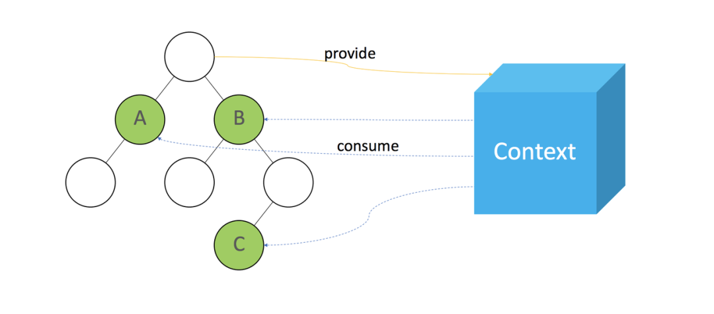

# Context

> React Context 官方认证的用于解决状态共享的 API，适合作为一次性共享消费的处理场景，数据结构应到越简单越好，例如：国际化，主题，注册等这类全局变化且需要强制更新的操作。context 的数据管理方案应当作为应用程序数据的一部分而非全局状态管理的通用解决方案。

## 核心

- 基于 createContext()创建一个全局可访问的 context：`const Context = React.createContext();`
- 在业务组件的外层上创建 provider：`<Context.provider value={initialValue}>{children}</Context.provier>`
- 在需要消费数据的组件中，通过 useContext 方法获取 value，必须在 propvider 的 children 组件中才能被调用：`const value = React.useContext(Context)`

## 缺点

- 页面重新渲染的问题，context 的值一旦变化，所有调用了 useContext() 的组件均会重新触发渲染更新
- Provider 层层嵌套，调试体验极差; 也不利于复杂 Store 结构的组织; 不同 Provider 之间的数据联动处理也较为繁琐。

