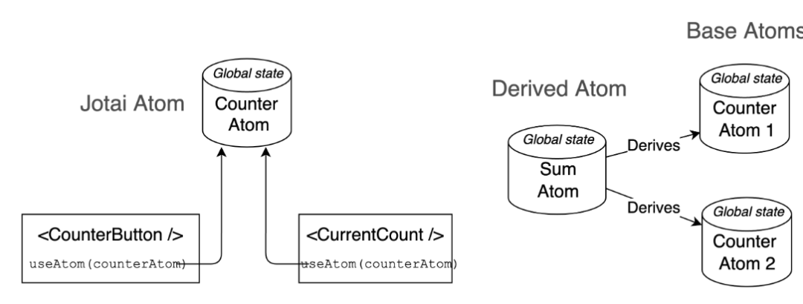

# Jotai

> 和 zustand 师出同门，基于原始 hooks 方式提供基础能力，同时可以灵活组织多个 atom 来创建新的 atom，并支持异步处理

jotai 可以看作是 recoil 的简化版本，都是采用分散管理原子状态的设计模式，但是相较于 recoil 更简洁，不需要显性使用 selector

## 核心步骤

- 在 `React` 的 `App` 组件中使用`Provider`进行包裹
- 定义`atom`原子状态，需要提供默认值，可以被任意组件订阅；
- 基于`atom`定义的状态可以使用`get`方法派生，`const newAtom = atom(get => get(baseAtom).toUpperCase())`;
- 在组件用可通过`useAtom(读/写)`，`useAtomValue(读)`，`useSetAtom(写)`操作状态。
- 不用感知同步异步操作，`async get` 回调中返回 `promise` 状态即可，可以与 `Suspense` 配合使用。
