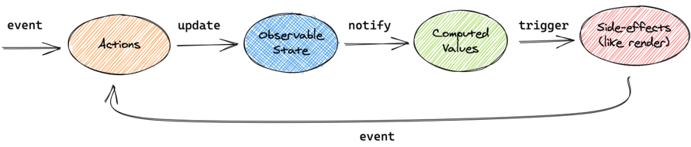

# Mobx

> 背后的哲学很简单：**任何源自应用状态的东西都应该自动地获得**， 其中包括UI、数据序列化、与服务器通信等

## 核心步骤

- 根据业务模块分拆成多 `store`，将需要做响应式更新的字段和方法通过`makeObservable`封装到一个 `class(object)`中并导出
- 将各个 `store` 进行集中整合，形成一个 `RootStore`；
- 基于 `createContext()` 创建 `context`，并将 `rootStore` 注入到 `context.provider` 的 value 中，`<RootStoreContext.Provider value={stores}>{children}</RootStoreContext.Provider>`;
- 将 `RootStoreContext.Provider` 包裹到在 React 的 App 组件外层；
- 在需要用到的组件中搭配`observer`和`useStores`实现最终调用。
