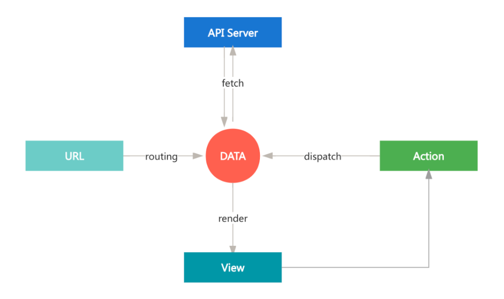
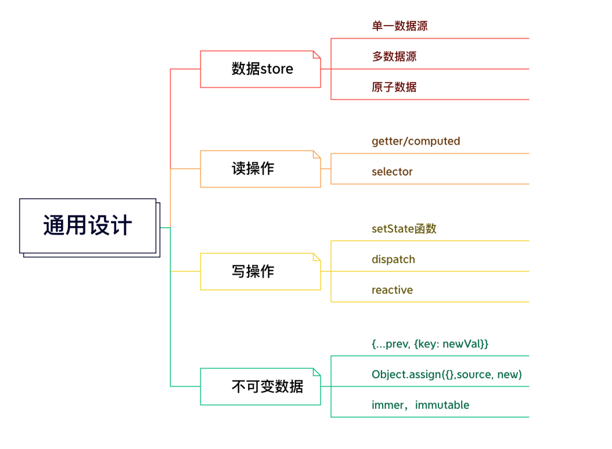
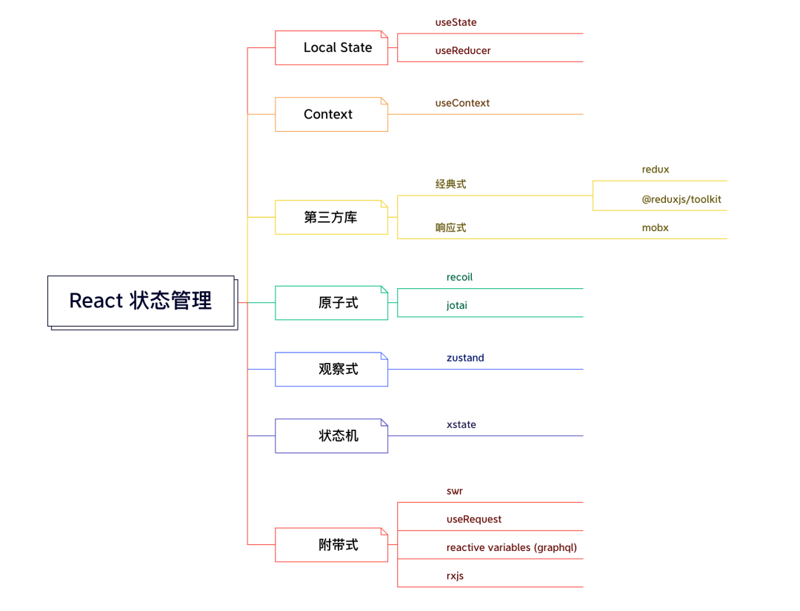

# State 状态管理

> Actions <=> State <=> View，优雅地实现跨层级组件间的数据通信和状态共享

数据状态变化：

通用设计：

React状态管理：

## 功能

- TypeScript 类型支持
- 友好的异步操作
- 支持优雅分割（中心化 → 去中心化，数据集合 → 元数据）
- 少重复样板代码
- 高内聚，低耦合，组件自治优先
- 支持状态间互相依赖
- 自带优化，精准更新
- 丰富的生态体系（middleware，plugin 等）
- 符合函数式特性（immutable，computed，memoization...）
- 同时支持 Class 与 Hooks 组件（新旧过渡）
- API 清晰简洁，上手简单

## 参考

- [全面体验八种状态管理库](https://mp.weixin.qq.com/s/Jgr1msPq2FCKacSnQf9fbQ)
