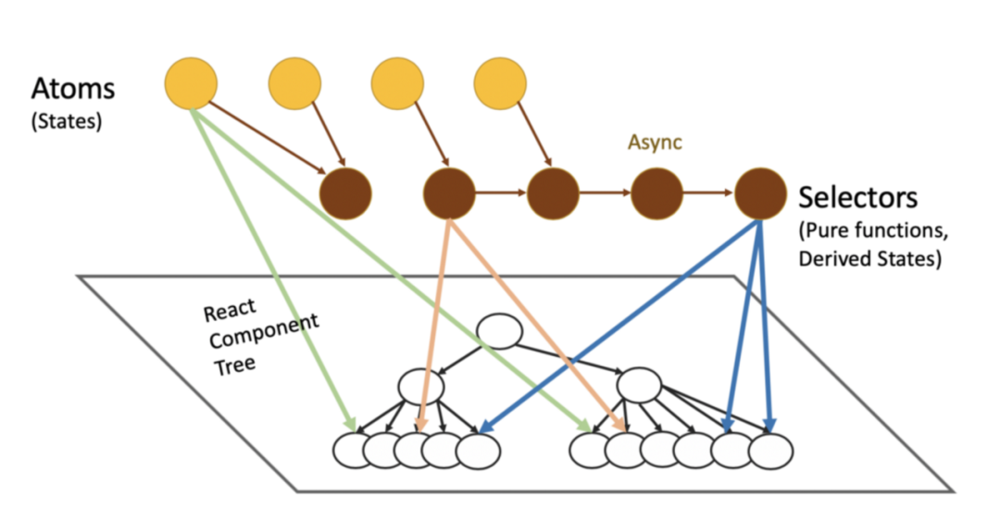

# Recoil

> 采用的是分散管理原子状态的设计模式，其核心概念只有 Atom(原子状态) 和 Selector(派生状态)

## 核心步骤

- 在 `React` 的 App 组件中使用`RecoilRoot`进行包裹；
- 定义`atom`原子状态，需要提供 `key` 和默认值，可以被任意组件订阅；
- 基于 `atom` 定义的状态可以使用`selector`派生，类似 `redux` 中的 `reselect` 或 `mobx` 的 `computed`；
- 在组件用可通过 `useRecoilState`(读/写)，`useRecoilValue`(读)，`useSetRecoilState`(写)操作状态。
- 不用感知同步异步操作，`async get` 回调中返回 `promise` 状态即可，可以与 `Suspense` 配合使用。
