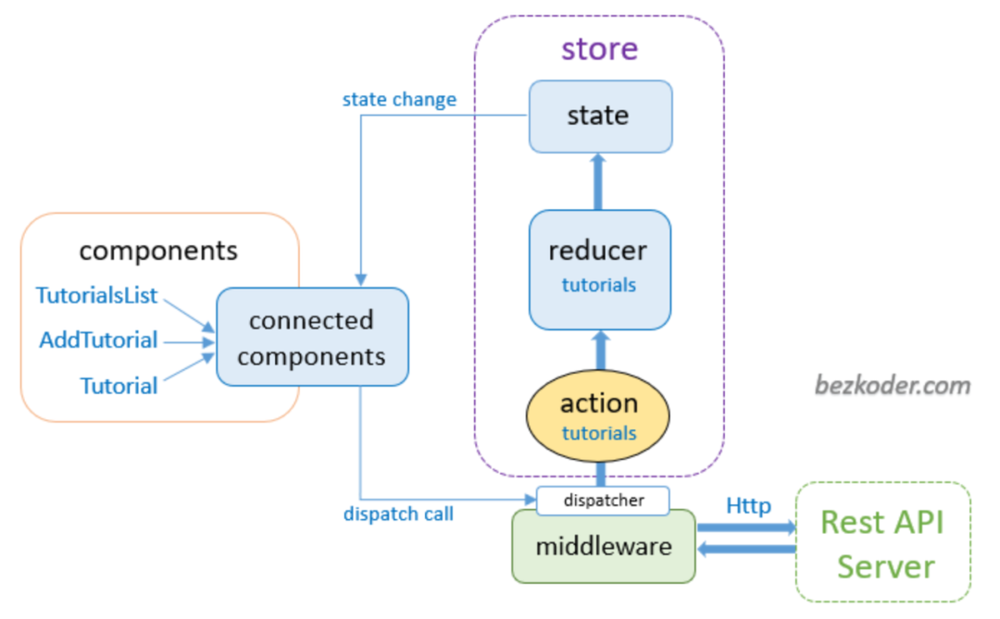
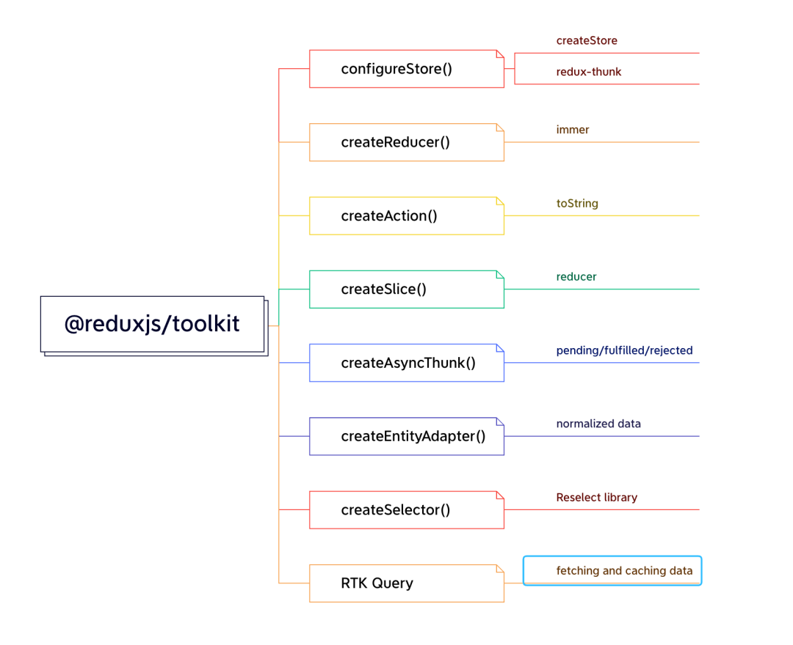

# Redux

> 状态库中的 学术经典，老而弥坚，臃肿复杂

## Redux-Toolkit

> 使用简版redux

核心步骤:

- 根据业务模块分拆 `features`，将 `state`，`reudcer` 等统一通过`createSlice`做好集成并导出；
- 将各个 `slice` 模块中的 `reducer` 通过`combineReducers`进行集中整合，形成 `rootReducer`；
- 将 `rootReducer` 和各个需要用到的 `middleware` 通过`configureStore`集中整合，形成 `store`
- 在 React 的 App 组件中包裹 react-redux 的 `Provider`，并注入 store，`<Provider value={store}>{children}</Provier>`
- 在需要用到的组件中通过`useSelector`和`useDispatch`的返回函数实现最终取值调用。
