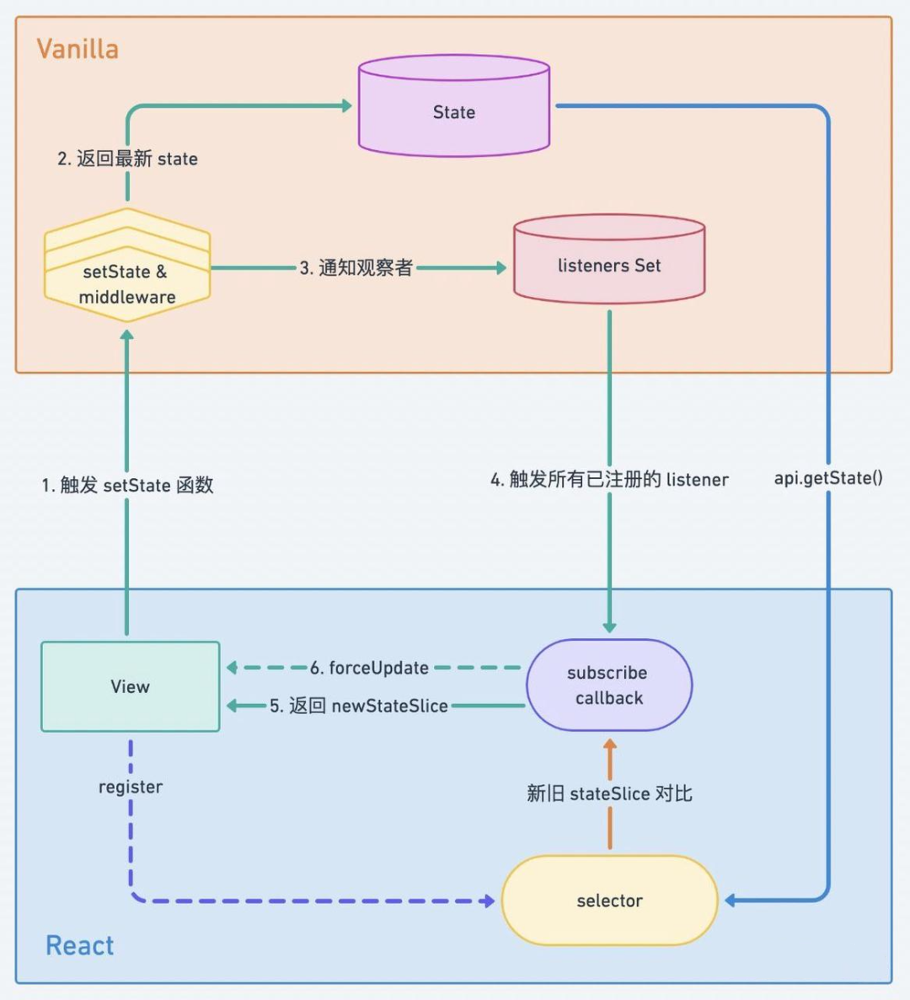

# Zustand

> 是一个实现非常精巧的状态管理库，分层合理优雅，中间件实现巧妙，大部分使用特性都在利用 React 语法，全面拥抱 hooks, 代码逻辑清晰简单

## 核心步骤

- 既支持单 `store` 加类 `reducer` 的管理方式，也可根据业务模块分拆成多 `store`，灵活可控；
- 使用`create((set, get)=> ({....}))`方法创建 ``store` 中的数据结构，默认 `immutable`；
- 像写 `hooks` 一样写 `action` 逻辑，不用感知同步还是异步操作；
- 不需要提供 `context provider`，不侵入业务设计；
- 在子组件中使用`useStore()`方法实现调用，自带 `selector` 和 `shallow` 比较，优化重复渲染
